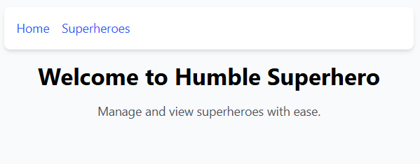
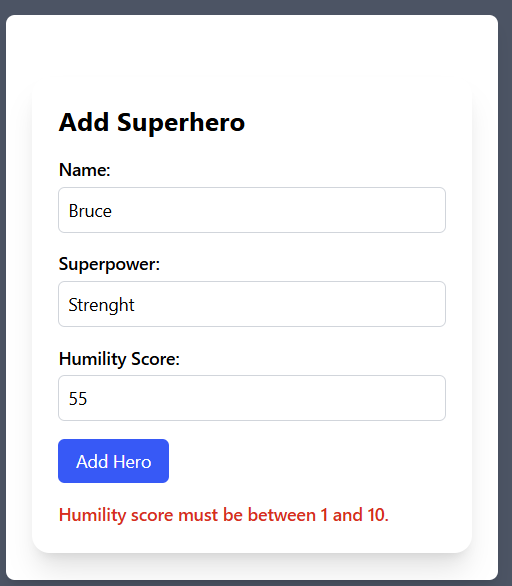
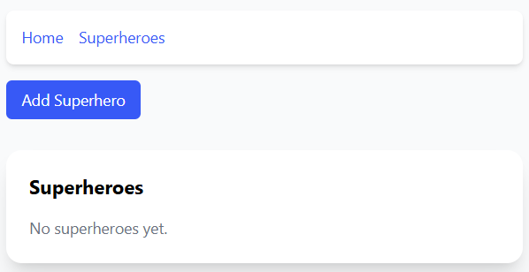
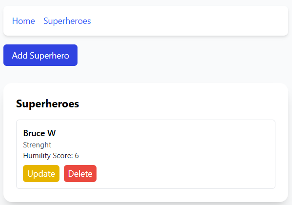
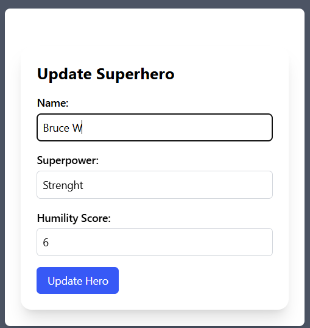
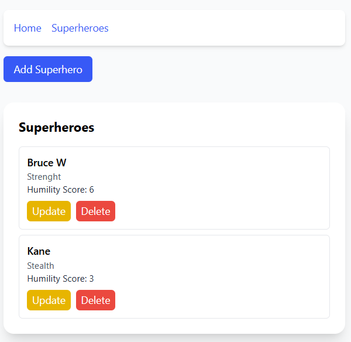

# Humble Superhero

## Overview
The **Humble Superhero API** is a simple backend service built with **NestJS, Prisma, BullMQ**, and **Zod validation** that allows users to manage superheroes. It provides functionality to:
- Add a superhero with a **name, superpower, and humility score (1-10)**.
- Fetch a list of superheroes, **sorted by humility score (descending order)**.
- Update an existing superhero's details.

This project was created as part of a **technical assignment** to demonstrate coding skills, teamwork, and eagerness to learn.

---

## 🚀 Getting Started

### 📌 Prerequisites
Ensure you have the following installed:
- [Docker](https://www.docker.com/)
- [Docker Compose](https://docs.docker.com/compose/)

### 🛠 Installation
1. Clone the repository:
    ```sh
    git clone https://github.com/cristiangirlea/humble-superhero.git
    cd humble-superhero
    ```

2. Build and start the containers:
    ```sh
    docker-compose up --build
    ```

3. Run the containers in the background:
    ```sh
    docker-compose up -d
    ```

4. Stop the containers:
    ```sh
    docker-compose down
    ```

---

## 🧪 Running Tests
To run the test environment and execute tests after the build:
```sh
docker-compose --profile test up --build
```
To manually run tests inside the container:
```sh
docker exec -it humble_backend sh
npm test
```

---

## 🌍 Accessing the API
- **Base URL**: [http://localhost:3000](http://localhost:3000)
- **API Documentation**: [http://localhost:3000/api](http://localhost:3000/api)

### **Example Endpoints**
| Method | Endpoint             | Description                        |
|--------|----------------------|------------------------------------|
| `POST`  | `/superheroes`       | Add a new superhero               |
| `GET`   | `/superheroes`       | Fetch the list of superheroes      |
| `PATCH` | `/superheroes/{id}`  | Update a superhero's details       |

---

## 🛢 Database Migrations
If using Prisma, run the following command to apply database migrations:
```sh
npx prisma migrate dev
```

---

## ⚙️ Additional Features

### BullMQ Integration
- **BullMQ** is used to manage asynchronous job queues, ensuring efficient background processing for tasks like notifications or heavy computations.

### Zod Validation
- **Zod** is used to validate incoming data for endpoints, ensuring:
  - The `humility score` is between 1 and 10.
  - All required fields are present and of the correct type.

---

## 🧑‍🤝‍🧑 Team Player Attitude
As a team player, I would:
- **Schedule regular check-ins** to align on progress and remove blockers.
- **Use code reviews** to maintain quality and share knowledge.
- **Pair program** on complex features to improve collaboration.
- **Document decisions** in the README and code comments for clarity.

---

## 🚀 Eagerness to Learn
### **If I had more time**
- I would implement **superhero teams or missions** to expand functionality.
- Implement user authentication and authorization to secure the API.
- Add more comprehensive tests, including integration tests.
- Enhance the frontend with more features, such as search and filter options.
- Deploy the application to a cloud provider for real-world usage.
- I would **add authentication** to restrict access to certain API features.

---

## 🏆 Why This Matters
At our company, we value **humility, teamwork, and continuous learning**. This task was an opportunity to:
- Demonstrate **clean and structured code**.
- Apply **best practices in API design**.
- Show **how I approach challenges and improve over time**.

---

## 🤝 Contribution
Want to contribute? Feel free to fork the repo and submit a PR!

---

## 📩 Submission Instructions
This solution is available as a **GitHub repository**. Let me know if you need further improvements!


## Screenshots

### Home Page


### Adding Hero


### Empty Hero List


### Hero List


### Updating Hero


### Hero in List


